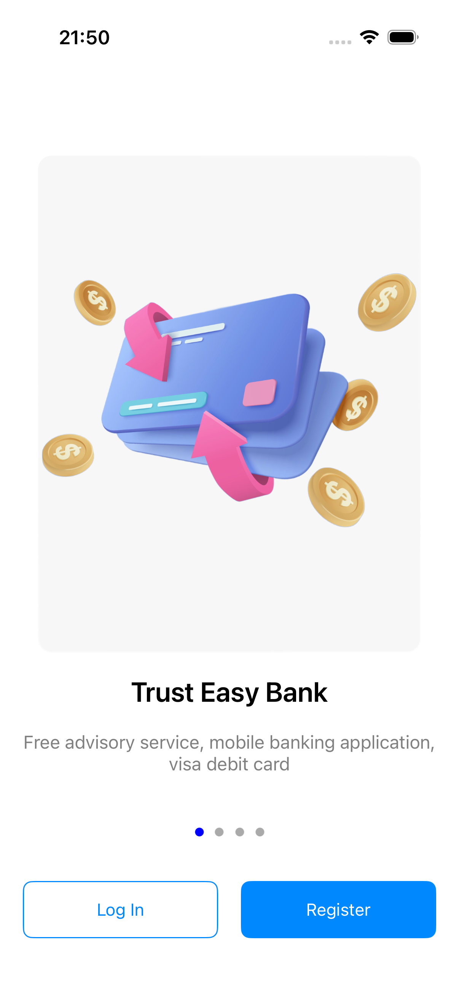
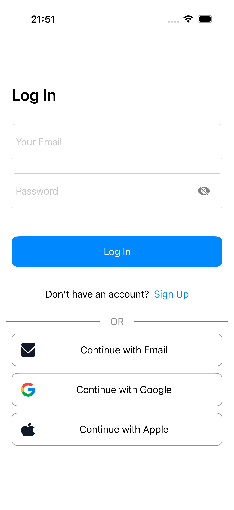
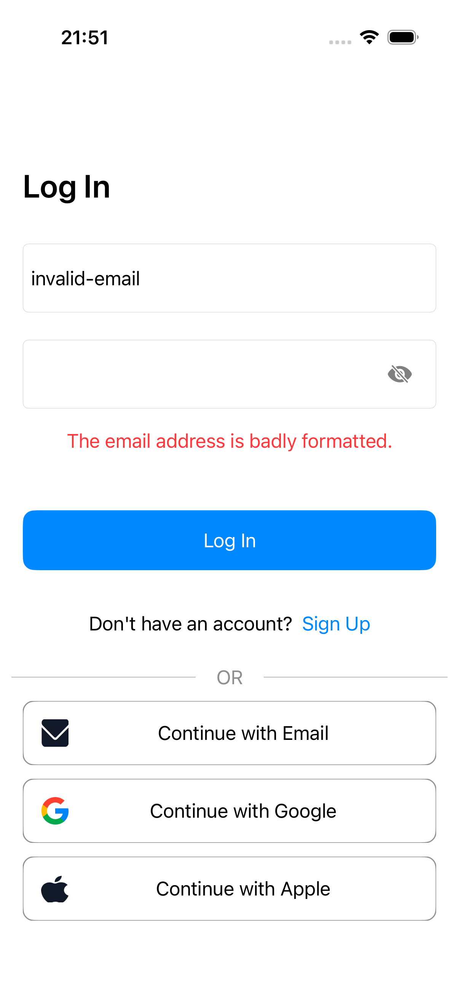
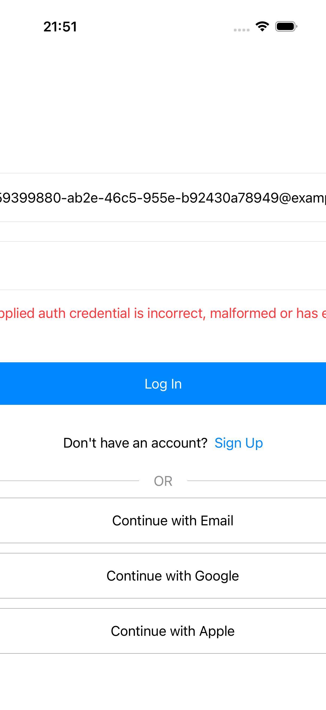
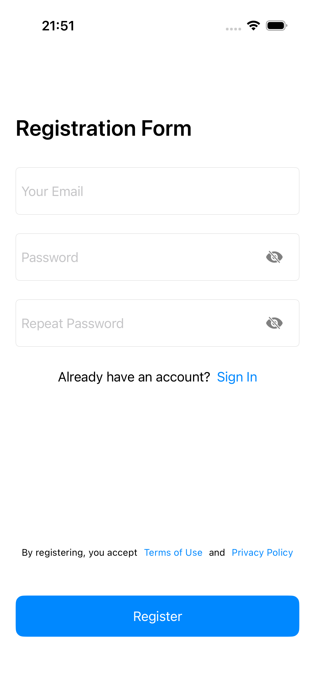
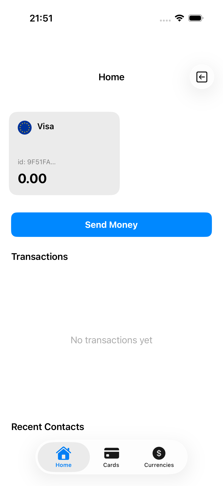
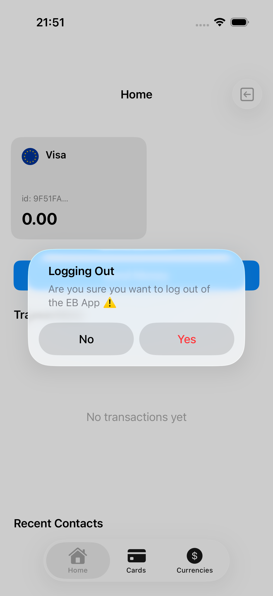

# EasyBank — UI reference for Windows students

Use this reference with [the Windows running guide](ios-actions-trial.md). You can read the screenshots, element inventory and UI tree extracts in VS Code or a browser. They provide the inspection information needed for the assignment; implement your own Page, Steps and Tests classes.

The reference covers onboarding, email/password login, registration, Home and logout. Money transfers, card management, currencies and social login are outside this assignment.

Captured on **7 October 2026**, iPhone 17 Pro / iOS 26.5, in local training mode. GitHub Actions uses iPhone 16 / iOS 18.5; system chrome and keyboard appearance can differ. Identifiers describe the app controls. The two error states and registration → logout → login flow were exercised during capture.

## Reading the inventory

- **Identifier** is the app's `accessibilityIdentifier`. It is case-sensitive and usually invisible on screen.
- **Label / placeholder** is visible text, which can differ from the identifier.
- **Type** determines the XCTest query family: Button → `buttons`, TextField → `textFields`, SecureTextField → `secureTextFields`, StaticText → `staticTexts`, Alert → `alerts`.
- Password fields are secure text fields while the password is hidden. Do not toggle password visibility for these scenarios.
- Some elements appear only after navigation, a server response or an alert. Wait for the expected state; a reference screenshot does not imply that an element exists immediately.
- UI trees are diagnostic snapshots. Do not use their coordinates, memory addresses or element order as locators. Use identifiers and scoped labels instead. See Apple's [element query documentation](https://developer.apple.com/documentation/xcuiautomation/xcuielementquery) and [debugDescription documentation](https://developer.apple.com/documentation/xcuiautomation/xcuielement/debugdescription).

## 1. Onboarding

[UI tree](reference/hierarchy/01-onboarding.txt)

| Element | Type | Identifier | Label |
| --- | --- | --- | --- |
| Open login | Button | `onboarding.login` | Log In |
| Open registration | Button | `onboarding.register` | Register |

The onboarding carousel changes its title and illustration. The two navigation buttons remain the relevant controls.

## 2. Login

[UI tree](reference/hierarchy/02-login.txt)

| Element | Type | Identifier | Label / placeholder |
| --- | --- | --- | --- |
| Email | TextField | `login.email` | Your Email |
| Password | SecureTextField | `login.password` | Password |
| Submit | Button | `login.submit` | Log In |
| Open registration | Button | `login.register` | Sign Up |
| Authentication error | StaticText | `login.error` | Dynamic authentication error message |

The heading and the submit button both display **Log In**. The onboarding login button has its own identifier. Error text is absent until authentication returns an error.

### Error states

| Invalid email format | Invalid credentials |
| --- | --- |
|  |  |

[Invalid email UI tree](reference/hierarchy/03-invalid-email.txt) · [Invalid credentials UI tree](reference/hierarchy/04-invalid-credentials.txt)

Read the current error element's label. The assignment specifies the relevant message fragments; screenshots are examples, not strings to copy in full.

## 3. Registration

[UI tree](reference/hierarchy/05-registration.txt)

| Element | Type | Identifier | Label / placeholder |
| --- | --- | --- | --- |
| Email | TextField | `registration.email` | Your Email |
| Password | SecureTextField | `registration.password` | Password |
| Repeat password | SecureTextField | `registration.repeatPassword` | Repeat Password |
| Submit | Button | `registration.submit` | Register |
| Open login | Button | `registration.login` | Sign In |
| Registration error, when present | StaticText | `registration.error` | Dynamic error message |

The registration error identifier is provided for diagnostics; the successful registration scenario does not display that element. On some iOS versions, a system **Use Strong Password?** prompt appears when focusing a registration password field. Dismiss it with **Close** to type your own test password. This is an OS prompt, not an app element; its layout can differ from the reference. The keyboard can change the visible area. Ensure a control is visible and hittable before interacting with it.

## 4. Home

[UI tree](reference/hierarchy/06-home.txt)

| Element | Type | Identifier | Label |
| --- | --- | --- | --- |
| Home tab | Button inside TabBar | — | Home |
| Send money | Button | `home.sendMoney` | Send Money |
| Logout icon | Button in NavigationBar | `home.logout` | Log Out |

Home contains generated account/card data. Do not hard-code the sample email, name, card number or balance in assertions. The Home tab and Send Money button identify the screen.

## 5. Logout confirmation

[UI tree](reference/hierarchy/07-logout-confirmation.txt)

| Element | Type | Identifier | Label |
| --- | --- | --- | --- |
| Confirmation dialog | Alert | — | Logging Out |
| Confirm logout | Button inside the alert | — | Yes |
| Cancel logout | Button inside the alert | — | No |

**Logging Out**, **Yes** and **No** are labels, not custom identifiers. Scope the Yes/No controls to the alert. Confirming logout returns to the login form, whose identifiers remain `login.email`, `login.password` and `login.submit`.

## What students must implement

The inventory supplies element discovery only. Locator declarations, reusable actions, waits, assertions, unique test data, test independence and the three complete scenarios remain student work. No completed scenario implementation is included in this package.
